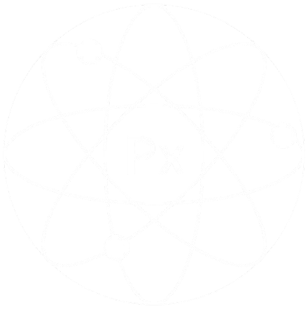

# 🌌 Spectra – Interactive Periodic Table
Spectra is a modern, interactive periodic table web app built with React.js.
It provides a clean, intuitive interface for exploring chemical elements, their properties, categories, isotopes, and atomic structures. The goal of Spectra is to make learning chemistry engaging, visually appealing, and accessible.

### ✨ Features
🔬 Interactive Periodic Table – Click on any element to view detailed information.

### 📑 Element Details 
Displays properties such as atomic number, symbol, category, isotopes, and isobars.

### ⚛️ Atomic Structure Visualization
Visual representation of the element’s atomic structure.

### 🎨 Modern UI
Clean dark theme design for better readability and focus.

### 🧩 Category Sidebar
Easily filter elements by their categories (e.g., metals, non-metals, noble gases).

### 📱 Responsive Design 
Works smoothly across desktops, tablets, and mobile devices.

### 🛠️ Tech Stack
- Frontend: React.js
- Styling: Tailwind CSS + Custom CSS
- Icon : Canva
- Data: JSON (containing full periodic table, isotopes, and isobars info)



### 🚀 Getting Started

1. Clone the repository
```
git clone https://github.com/yourusername/spectra.git
cd spectra
```
2. Install dependencies
```
npm install
```
3. Run the development server
```
npm start
```
4. Build for production
```
npm run build
```
### 📂 Project Structure
```
spectra/
├── public/               # Static assets
├── src/
│   ├── components/       # Reusable UI components
│   │   ├── AtomicCard.js
│   │   ├── DetailView.js
│   │   ├── AtomicStructure.js
│   │   └── CategorySidebar.js
│   ├── data/             # JSON data for elements, isotopes, isobars
│   ├── App.js            # Main application component
│   └── index.js          # Entry point
├── package.json
└── README.md
```
### 🌍 Future Enhancements
### 🔍 Search functionality to quickly find elements.
### 🎥 3D atomic orbital visualizations.
### 📊 Compare multiple elements side by side.
### 🧮 Interactive quizzes for students.

### 📜 License
```
This project is licensed under the MIT License – feel free to use, modify, and share it.
```